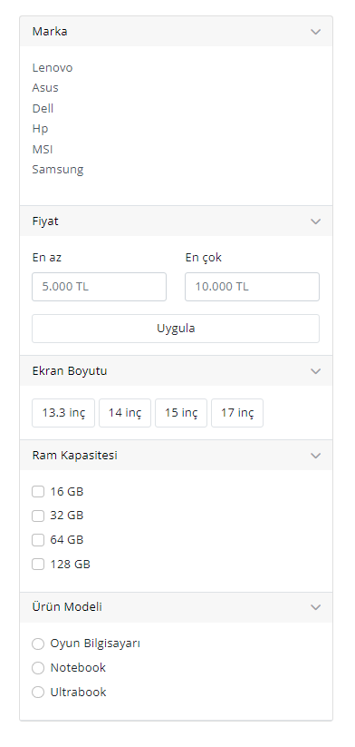

# Filter Boxes 🎛️

## Overview
The *Filter Boxes* project is a web application that allows users to filter products based on different criteria such as brand, price range, screen size, RAM capacity, and product model.

## Technologies Used
- HTML
- CSS (Bootstrap 5)
- JavaScript

## Features
1. **Brand Filter:**
   - Select from popular laptop brands like Lenovo, Asus, Dell, Hp, MSI, and Samsung.

2. **Price Range Filter:**
   - Set the minimum and maximum price range for your budget.

3. **Screen Size Filter:**
   - Choose from various screen sizes, including 13.3 inches, 14 inches, 15 inches, and 17 inches.

4. **RAM Capacity Filter:**
   - Check the desired RAM capacity options, such as 16GB, 32GB, 64GB, and 128GB.

5. **Product Model Filter:**
   - Select the product model type, including Oyun Bilgisayarı, Notebook, and Ultrabook.

## Usage
1. Click on the headers to expand or collapse the filter options.
2. Choose the desired filters for brand, price range, screen size, RAM capacity, and product model.
3. Click the "Apply" button to apply the selected filters.

## Live Demo
Live Demo: [Filter Boxes Demo]()

## Installation
No special installation is required for this project. Simply download the project files and open the `index.html` file in a web browser.

## Contributing
Feel free to use, modify, and contribute to the project! If you have any questions or feedback, you can reach me at nisagokdemir@gmail.com

## License
This project is licensed under the **MIT License**.
